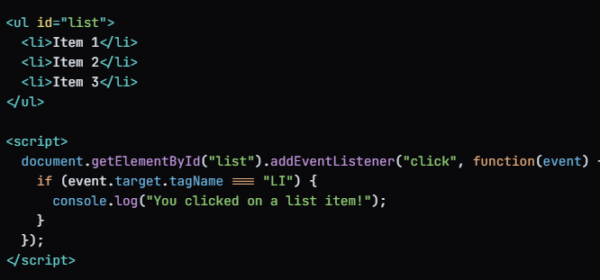

# Event Delegation

This came into picture due to Event bubbling

Event delegation is a technique in JavaScript where you attach a single
event listener to a parent element, and then use that listener to handle
events that occur on its child elements. This approach is useful when you
have a large number of elements that need to respond to the same event,
as it reduces the number of event listeners needed and improves performance.

ex:

In this example, we attach a single event listener to the ul element, and
then use that listener to handle clicks on its child li elements. When a
click event occurs on an li element, the event bubbles up to the ul element,
where our event listener is triggered. We then use the event.target property
to determine which element was actually clicked, and respond accordingly.
