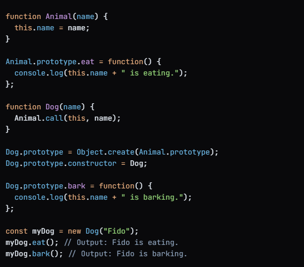

# Prototype & Prototypal Inheritance

In JavaScript, the prototype is a fundamental concept that allows
objects to inherit properties and methods from other objects.

Prototypal inheritance is a mechanism that enables objects to inherit
behavior from other objects, creating a chain of inheritance.

When we use . ,we get list of pre-defined methods to use

Due to protoype, we get access to these hidden properties

whenever we create object/array or function etc, JS
attaches another object to our original object.
so, that how we have access to pre-defined methods
